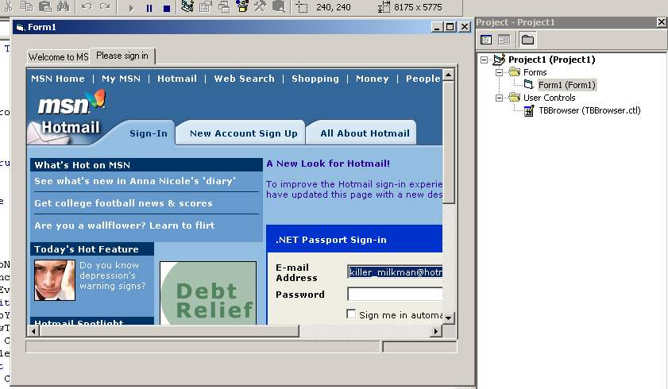



## Tabbed Browser Control

### Description

This is just a simple control designed as a drop-in component to allow a Tabbed Browser environment. I was working on a browser for personal use using tabs and a few people I work with, including my IT manager wanted apps done, using the interface, so I dedicded to make this control to make it easier to create the apps quickly. You can Add/Delete tabs, Block/Query popup tabs (popups display in a new tab)

If you like this....Please vote....if not, don't

Any/All CONSTRUCTIVE CRITISISM is welcome....

Please be easy....this is my first submission and I thought that maybe others would find it useful

:-)
 
### More Info
 

             |
---                |---
**Submitted On**   |2002-10-12 13:50:42
**By**             |[Ken R\. Beaudry](https://github.com/Planet-Source-Code/PSCIndex/blob/master/ByAuthor/ken-r-beaudry.md)
**Level**          |Intermediate
**User Rating**    |4.7 (33 globes from 7 users)
**Compatibility**  |VB 4\.0 \(32\-bit\), VB 5\.0, VB 6\.0
**Category**       |[Custom Controls/ Forms/  Menus](https://github.com/Planet-Source-Code/PSCIndex/blob/master/ByCategory/custom-controls-forms-menus__1-4.md)
**World**          |[Visual Basic](https://github.com/Planet-Source-Code/PSCIndex/blob/master/ByWorld/visual-basic.md)
**Archive File**   |[Tabbed\_Bro14511510122002\.zip](https://github.com/Planet-Source-Code/ken-r-beaudry-tabbed-browser-control__1-39764/archive/master.zip)

